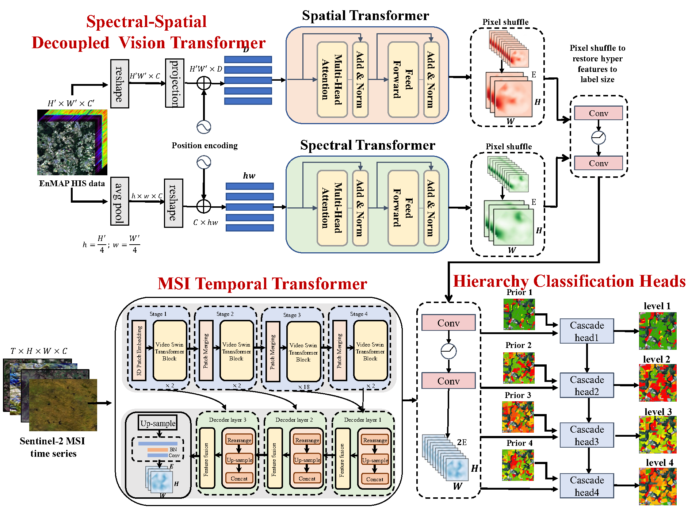
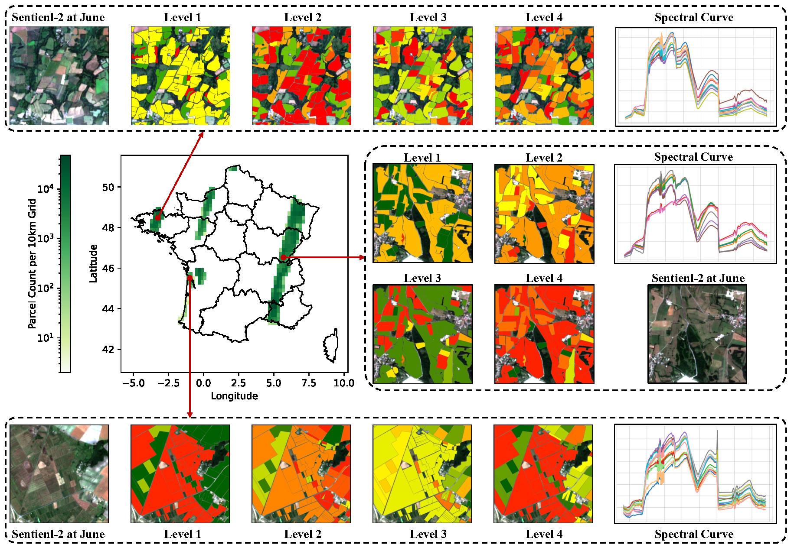

<div align="center">
    <h2>
        A Novel Large-scale Crop Dataset and Dual-stream Transformer Method for Fine-grained Hierarchical Crop Classification from  Integrated Hyperspectral EnMAP Data and Multispectral Sentinel-2 Time Series    
    </h2>
</div>


[](LICENSE)
[]()

<div align="center">
    
</div>

## Introduction

This repository is the code implementation of the paper 
[A Novel Large-scale Crop Dataset and Dual-stream Transformer Method for Fine-grained Hierarchical Crop Classification from  Integrated Hyperspectral EnMAP Data and Multispectral Sentinel-2 Time Series]().

We construct a hierarchical hyperspectral crop dataset (H2Crop) by integrating 30m-resolution EnMAP hyperspectral data with Sentinel-2 time series. With over one million annotated field parcels organized in a four-tier crop taxonomy, H2Crop establishes a vital benchmark for fine-grained agricultural crop classification and hyperspectral image processing. We propose a dual-stream Transformer architecture that synergistically processes these modalities. It coordinates two specialized pathways: a spectral-spatial Transformer extracts fine-grained signatures from hyperspectral EnMAP data, while a temporal Swin Transformer extracts crop growth patterns from Sentinel-2 time series. The designed hierarchy classification heads with hierarchical fusion then simultaneously delivers multi-level classification across all taxonomic tiers.
Experiments demonstrate that adding hyperspectral EnMAP data to Sentinel-2 time series yields a 4.2% average F1-scores improvement (peaking at 6.3%). Extensive comparisons also confirming our method's higher accuracy over existing deep learning approaches for crop type classification and the consistent benefits of hyperspectral data across varying temporal windows and crop change scenarios.

## Table of Contents

- [Introduction](#Introduction)
- [Table of Contents](#Table-of-Contents)
- [Installation](#Installation)
- [Dataset Preparation](#Dataset-Preparation)
- [Model Usage](#Model-Training)
- [Citation](#Citation)
- [License](#License)
- [Contact](#Contact)

## Installation

### Dependencies

- Linux or Windows
- Python 3.9+, recommended 3.9.18
- PyTorch 2.0 or higher, recommended 2.1
- CUDA 11.7 or higher, recommended 12.1
- MMCV 2.0 or higher, recommended 2.1.0
 
### Environment Installation

We recommend using Miniconda for installation. The following command will create a virtual environment named `H2Crop` and install PyTorch,GDAL and other libraries.

Note: If you have experience with Conda, pytorch, GDAL and have already installed them, you can skip to the next section. Otherwise, you can follow these steps to prepare.

<details>


**Step 0**: Install [Miniconda](https://docs.conda.io/projects/miniconda/en/latest/index.html).

Then you can quickly create environment by running the following command in your terminal:

```shell
conda env create -f environment.yml  
```

If it does not work, you can manually install the dependencies by following the steps below.

**Step 1**: Create a virtual environment named `H2Crop` and activate it.


```shell

conda create -n H2Crop python=3.9 -y

[conda] activate H2Crop

```


**Step 2**: Install [PyTorch](https://pytorch.org/get-started/locally/).


```shell

conda install pytorch==2.1.1 torchvision==0.16.1 torchaudio==2.1.1 pytorch-cuda=12.1 -c pytorch -c nvidia

```


**Step 3**: Install [MMCV](https://mmcv.readthedocs.io/en/latest/get_started/installation.html).


```shell

pip install -U openmim

mim install "mmcv==2.1.0"

```


**Step 4**: Install other dependencies.


```shell

pip install ftfy tqdm regex h5py prettytable timm scipy einops numpy==1.26.2

```

</details>

## H²Crop Dataset
Download the dataset from [H2Crop](https://glass.hku.hk/casual/Release/H2Crop/).

### Overview
The H²Crop dataset is a large-scale benchmark for hierarchical crop classification, combining 30m-resolution EnMAP hyperspectral imagery with 10m-resolution Sentinel-2 time series across France's agricultural regions. It features:
- **1,023,489 annotated parcels** covering 2022-2023 growing seasons
- **16344 images** with 30m EnMAP hyperspectral data and 10m Sentinel-2 multispectral data
- **Four-tier taxonomic hierarchy** (6  → 36  → 82  → 101 )
- **Pixel-aligned hyperspectral-temporal data** with cloud-free acquisitions
- **Corresponding shapefiles** for further field boundary analysis

The level-1 to level-4 crop types and their corresponding crop names can be found in the [cascade_labels](resources/cascade_labels.csv).

Here is the study area and some example images from the dataset:
<div align="center">
    
</div>


## Dataset Structure

The dataset is organized as follows for easy integration into deep learning pipelines:
```
H2Crop/
│
├── data_lists/              # Sample split definitions
│   ├── train.txt            # 12,016 training samples (e.g., "sample_001")
│   ├── val.txt              # 2,112 validation samples  
│   └── test.txt             # 2,216 test samples
│
├── h5_data/                 # Data in HDF5 format
│   ├── sample_001.h5        # Sample data file
│   ├── sample_002.h5
│   └── ...
```

### HDF5 Structure (Per Sample)
Each HDF5 file contains these standardized groups:

| Group    | Shape              | Dtype  | Description                           |
|----------|--------------------|--------|---------------------------------------|
| `/EnMAP` | (218, 64, 64)      | int16  | EnMAP hyperspectral cube (400-2500nm) |
| `/S2`    | (12, 10, 192, 192) | int16  | Monthly Sentinel-2 composites         |
| `/label` | (4, 192, 192)      | uint8  | Hierarchical labels (L1-L4)           |
| `/prior` | (4, 192, 192)      | uint8  | Crop types from last year (L1-L4)     |


## Model Training and Testing

### Configuration Files
All model configurations are stored in `configs/` directory with naming convention:  
`[levelX_][crops]_S2_[H][_P]_Month.py`

| Naming Component | Options           | Description                          |
|------------------|-------------------|--------------------------------------|
| `levelX`         | `level1`-`level4` | Specific hierarchy level (optional)  |
| `crops`          | (always present)  | Base config identifier               |
| `H`              | `H` or omitted    | Include hyperspectral data           |
| `P`              | `P` or omitted    | Include prior crop information       |
| `Month`          | `jun/Aug/Oct/Dec` | Temporal window end month            |

**Examples**:
- `crops_S2_H_jun.py`: Full hierarchical classification with hyperspectral (Jan-Jun)
- `level3_crops_S2_P_Oct.py`: Level-3 only with prior info (Jan-Oct)

### Pre-trained Weights
The models for S2 data is designed based on [AgriFM](https://github.com/flyakon/AgriFM), so you need to download the pre-trained weights of AgriFM first.
```bash
wget https://glass.hku.hk/casual/Release/AgriFM/AgriFM.pth -P ../checkpoints/
```


### Training Commands
Take `crops_S2_H_jun.py` as an example, which trains a model with Sentinel-2 and EnMAP data for the first half of the year (January to June).
**Single GPU**:
```bash
python train.py configs/hyper_benefits/crops_S2_H_jun.py
```

**Multi-GPU (4 GPUs)**:
```bash
python -m torch.distributed.launch \
    --nnodes=1 \
    --node_rank=0 \
    --nproc_per_node=4 \
    --master_port=25055 \
    train.py \
    configs/hyper_benefits/crops_S2_H_jun.py\
    --launcher pytorch  ${@:3}
```

### Testing
```bash
python test.py \
  configs/crops_S2_H_jun.py \
  ../checkpoints/hyper_benefits/best_mFscore_epoch_xx.pth 
```
best_mFscore_epoch_xx.pth is the best model weights saved during training. You need to replace it with the actual path of the model weights you want to test.


> **Note**: Model weights will be available soon in [weights](https://glass.hku.hk/casual/Release/AgriFM/).


## Citation

If you use the code or performance benchmarks of this project in your research, please refer to the bibtex below to cite.

```

```

## License

This project is licensed under the [Apache 2.0 license](LICENSE).

## Acknowledgements
This project is built upon [OpenMMLab](https://openmmlab.com/). We thank the OpenMMLab developers.

The crop types hierarchy is based on the [EuroCrops](https://github.com/maja601/EuroCrops).

Our model is built upon [Video Swin Transformer](https://github.com/SwinTransformer/Video-Swin-Transformer).


## Contact

If you have any other questions or suggestions, please contact Wenyuan Li ([liwayne@hku.hk](mailto:liwayne@hku.hk)).

